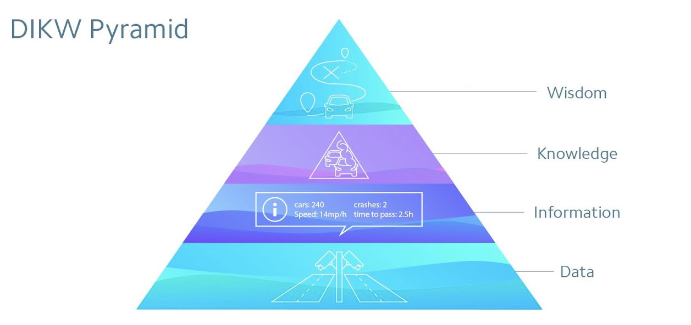
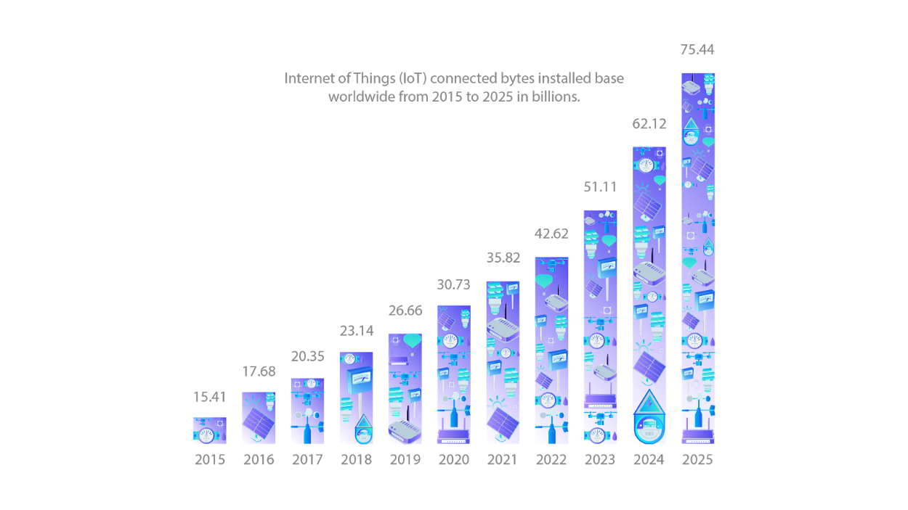
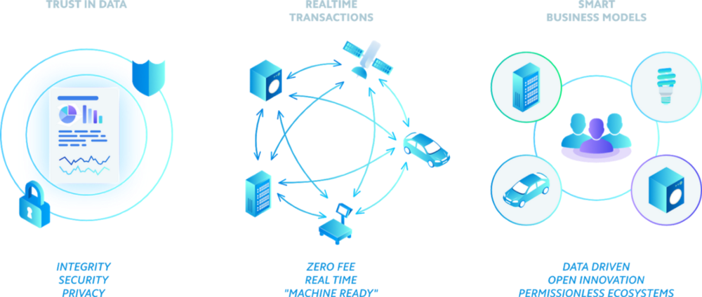

# Data Marketplace overview

**Data silos make it difficult to buy and sell data among different data points. To overcome this challenge, the Data Marketplace uses IOTA MAM streams to to open up the data silos and allow users to make micropayments of IOTA tokens to the data owners in exchange for data.**

Data is one of the most fundamental ingredients in the machine economy and the connected world. It is the foundation upon which the other strata of the **D**ata — **I**nformation — **K**nowledge — **W**isdom (**DIKW**) pyramid are dependent. Without this primary substrate, nothing can be established about the world. A datum (plural: data) is the raw value of a qualitative or quantitative variable: A pure unfiltered input from reality. Data sets that are structured and thus have had meaning extracted from them constitute what we consider to be information. Information tells us something concrete and coherent about the world through context. Contextualized information thus makes up what we know as knowledge, which in turn gives rise to our (and our machines’) ability to make wise decisions. Wisdom is knowledge applied.

The above image shows how the different echelons of this hierarchy are intertwined:

* **Data:** The sensors (cameras) monitoring the road are receiving signals from the photons reflecting off the surface of their environment
* **Information:** The measured speed of the moving objects and their relative positions is the meaningful information extracted from this data
* **Knowledge:** This information is then contextualized and distilled into knowledge, telling the drivers on the road via over-the-air ​updates that the road may be congested due to a crash
* **Wisdom:** This knowledge allows drivers to take an alternative route

## Business case

Over the next next decade, there will be more than 75 billion connected devices that interact in different manners. This will give rise to a machine economy where devices will trade everything from storage to electricity and sensor data. The data trade in this pilot project will highlight and explore the potential of these developments. With the prospect of tens of billions of devices generating data, we will see a proliferation of data that is unmatched in history.

## Challenges

The largest obstacle preventing the fulfillment of the grandeur envisaged by Big Data is the fact that the overwhelming majority of data remains locked in what is called data silos.

Data silos do not, or very rarely, share data outside their own closed environment. This environment leads to enormous quantities of wasted data. In fact, often, over 99% of data is lost to the void ([source: McKinsey 2015](https://www.mckinsey.com/mgi/overview/in-the-news/by-2025-internet-of-things-applications-could-have-11-trillion-impact)). This lost data could potentially contain extremely valuable information if allowed to flow freely in open, decentralized data streams that are accessible to any compensating party.

There are several reasons for the cumbersome and wasteful status quo. On the one hand, data wants to be free in the sense that its storage and transmission costs less and less over time. On the other hand, large quantities of data are extremely valuable and are not free to generate. These diametrically opposed conditions cause a gridlock that needs to be broken in order for Big Data to become truly big. A major cause of this is the fact that, while data sharing is becoming cheaper from a technological perspective, it is prohibitively expensive to sell fine, granular data in real-time due to intermediary fees — not to mention all the red tape one has to cut through in order to complete a single data purchase. These conditions make real-time data trade all but impossible. By 2025 it is projected that around 95% of all data will be generated by IoT devices in real-time ([source: IDC 2017](https://www.seagate.com/files/www-content/our-story/trends/files/idc-seagate-dataage-whitepaper.pdf)), so this is a pressing issue.

A third obstacle is the lack of ensured authenticity and audit trails of data. Before the adoption of distributed ledger technologies, data transmission protocols and databases were susceptible to various attacks, including middleman attacks and data tampering. Data is only as valuable as it is valid. In short, if the data input is garbage, the output will also be garbage.

## Solution

The IOTA Foundation launched the [Data Marketplace](https://data.iota.org) as a proof of concept (PoC) and as an open innovation ecosystem.

As a not-for-profit organisation, the IOTA Foundation has developed this project to produce an open source technology and empower other organisations to shape their own IOTA-enabled Data Marketplaces, with associated products and services. IOTA’s Data Marketplace PoC is not a launchpad for a future commercial service by the IOTA Foundation.

The growth of Data Marketplaces is an inevitable result of the IoT (Internet of Things) revolution. As physical assets such as ships, factories, vehicles, farms or buildings become digital, their digital twins will gradually act as secure data exchanges. As data streams surge across silos and carry value across organisations, traditional value chains will transition into a web of value. This paradigm will be more complex to administer, forcing business to rethink their competitive play as part of these ecosystems. Data marketplaces will emerge as a means to exchange data, monetise data streams and provide the basis of new “smart” business models. We refer to this new wave of value creation, for the Internet of Everything, as the “Economy of Things”.

### Objectives of the initiative

To realise the potential of data marketplaces, several key challenges had to be addressed.

IOTA and its Data Marketplace initiative help to address these challenges with an initial Proof of Concept and a growing open innovation ecosystem. We invite all participants to help shape the IOTA technology as a common standard that works for all, and co-create new business models for the “Economy of Things”.

The initiative’s objective was to do the following:

* Produce an open source proof of concept
* Explore business model innovation
* Grow a co-creation ecosystem to foster permissionless innovation

Like its technology, the IOTA Foundation’s approach to enabling innovation is open and permissionless. Our ambition is to enable the ecosystem to co-create and develop new IoT / M2M solutions and business models, but not to drive and push specific solutions to market.

The Data Marketplace is designed to enable an agile, experiment-driven and collective approach to innovation for its participants, but also for the IOTA Foundation itself. This initiative challenges the IOTA technology with the requirements of real life deployments and the demand of the Data Marketplace participants. We aim to adapt our technology to meet these demands.

## Demo

See this website for a [demonstration of the application](https://data.iota.org/).

## Abbreviations

MAM - Masked Authentication Messaging is a second layer data communication protocol which adds functionality to emit and access an encrypted data stream, like RSS, over the Tangle [https://blog.iota.org/introducing-masked-authenticated-messaging-e55c1822 d50e](https://blog.iota.org/introducing-masked-authenticated-messaging-e55c1822 d50e)

## Additional resources

- Data Marketplace Repository - https://github.com/iotaledger/data-marketplace
- Data Marketplace API documentation - https://data.iota.org/static/docs
- MAM Repository - https://github.com/iotaledger/mam.client.js
- iota.js Repository - https://github.com/iotaledger/iota.js