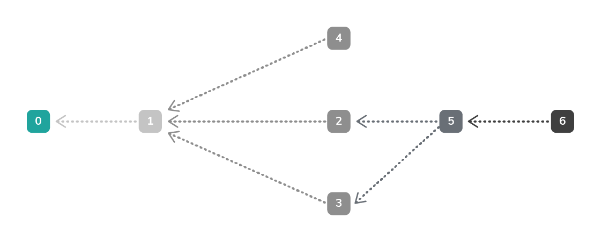

# What is the Tangle?

**The Tangle is the name of the data structure that's formed when transactions are appended to the ledger. This data structure prevents**

One of the validation critera of a transaction is that each one must directly reference two previous transactions (tip transactions). 

This referencing model forms a type of [directed acyclic graph](https://en.wikipedia.org/wiki/Directed_acyclic_graph) (DAG), in which each transaction represents a vertex.

In this diagram, transaction 5 is **directly** referenced by transaction 6. Because transaction 5 directly references transaction 3, transaction 3 is **indirectly** referenced by transaction 6.

Tip transactions are chosen by IRI nodes during a process called tip selection.

## Transaction protection

Transaction in an IOTA network are tamper-proof thanks to the Tangle.

The contents of a transaction (who transfers what to whom) and the referenced tip transactions are used to create a transaction's hash. This transaction hash links the transaction with its referenced ones, and is then locked by doing some computations called proof of work.

The more transactions that directly or indirectly reference a transaction, the more transactions that are linked to it and the stronger the lock becomes.

As a result, to unlock and change a transaction, an attacker would have to redo the proof of work for not only that transaction, but all of its referenced transactions, making the process too expensive and time-consuming.

[Learn more about tip selection, proof of work, and the Tangle](root://the-tangle/0.1/introduction/overview.md).