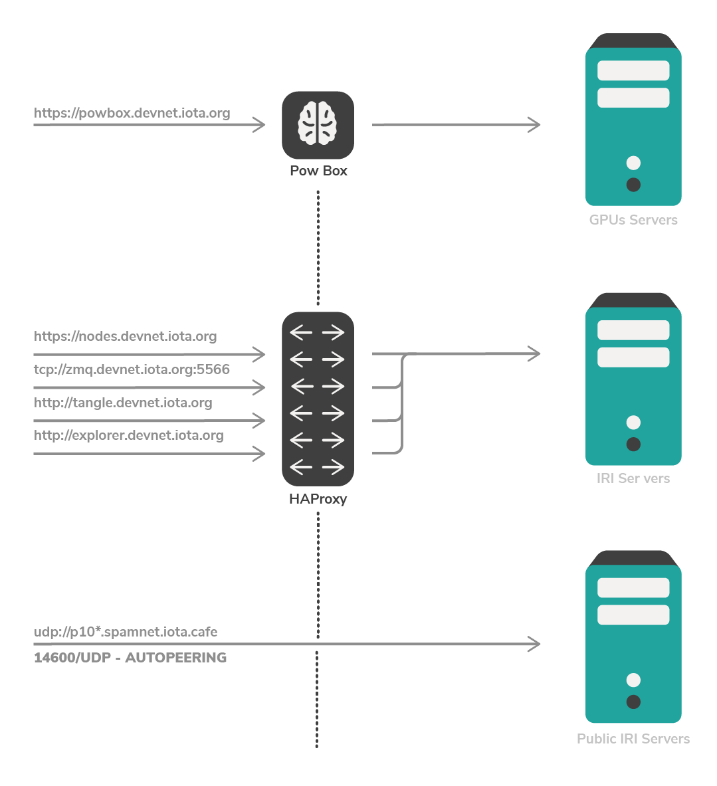
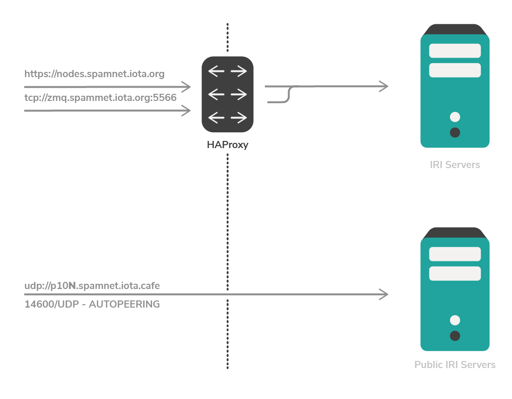

# IOTA networks

**An IOTA network consists of nodes that are mutually connected to neighbors.**

IOTA has the following [permissionless networks](../introduction/what-is-dlt.md):
* **Mainnet:** IOTA token
* **Devnet:** Devnet token (free)
* **Spamnet:** Spamnet token (free)

All permissionless networks consist of nodes, clients, and the Coordinator.

:::info:
If you want to create and test an application on a permissioned (private) network, you can do so by running an instance of the open-source Coordinator code called [Compass](root://compass/0.1/introduction/overview.md).
:::

## Mainnet

When you buy IOTA tokens from a cryptocurrency exchange, those tokens are valid on the Mainnet.

### Minimum weight magnitude

Transactions on the Mainnet must use a [minimum weight magnitude](root://iota-basics/0.1/concepts/minimum-weight-magnitude.md) (MWM) of 14 to be valid.

## Devnet

The Devnet is a copy of the Mainnet.

On this network, you can test your applications and build proof of concepts that use [free Devnet tokens](https://faucet.devnet.iota.org). The faucet website will send 1000 Devnet tokens to the specified address.

### Minimum weight magnitude

Transactions on the Mainnet must use a [minimum weight magnitude](root://iota-basics/0.1/concepts/minimum-weight-magnitude.md) (MWM) of 9 to be valid. Compared to the Mainnet, this MWM reduces the time it takes for [proof of work](root://the-tangle/0.1/concepts/proof-of-work.md) (PoW) to be completed.

### IRI nodes

We host the following public IRI nodes on the Devnet:

#### Load balancer node

This endpoint gives you access to a high-availability proxy server, which is running an IRI node on the Devnet.

Use the load balancer for sending transactions and requesting information about the ledger from the IRI node.

**URL:** https://nodes.devnet.iota.org:443

#### ZMQ node

This endpoint gives you access to the [zero message queue](root://iri/0.1/concepts/zero-message-queue.md) of an IRI node on the Devnet.

Use the ZMQ node to subscribe to events in an IRI node.

**URL:** tcp://zmq.testnet.iota.org:5556

#### PoW node

This endpoint gives you access to an IRI node that can do proof of work.

Use the PoW node to save power on small devices.

**URL:** https://powbox.devnet.iota.org

## Spamnet

The Spamnet is for applications that spam transactions.

On this network, you can test your applications and build proof of concepts that use [free Spamnet tokens](https://faucet.spamnet.iota.org).

### Minimum weight magnitude

Transactions on the Mainnet must use a [minimum weight magnitude](root://iota-basics/0.1/concepts/minimum-weight-magnitude.md) (MWM) of 7 to be valid. Compared to the Mainnet, this MWM reduces the time it takes for [proof of work](root://the-tangle/0.1/concepts/proof-of-work.md) (PoW) to be completed.

### IRI nodes

We host the following public IRI nodes on the Spamnet:

#### Load balancer node

This endpoint gives you access to a high-availability proxy server, which is running an IRI node on the Spamnet.

Use the load balancer for sending transactions and requesting information about the ledger from the IRI node.

**URL:** https://nodes.spamnet.iota.org:443

#### ZMQ node

This endpoint gives you access to the [zero message queue](root://iri/0.1/concepts/zero-message-queue.md) of an IRI node on the Spamnet.

Use the ZMQ node to subscribe to events in an IRI node.

**URL:** tcp://zmq.spamnet.iota.org:5556 
