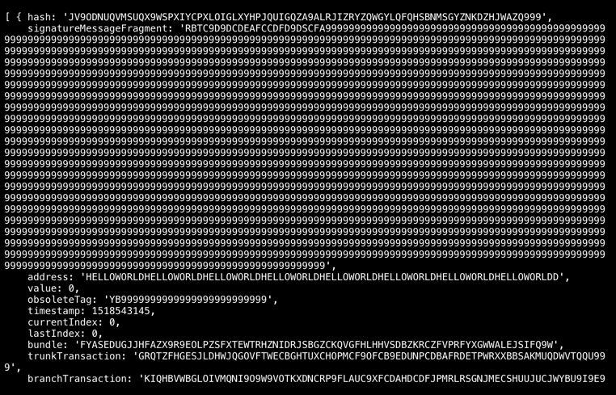

# Send your first zero-value transaction (Node.js)

**A zero-value transaction can be sent using a random seed that doesn't contain IOTA tokens. These transactions are useful for applications that want to send and store immutable messages on the Tangle.**

## Prerequisites

To complete this tutorial, you need the following:

* [Node JS (8+)](https://nodejs.org/en/)
* A code editor such as [Visual Studio Code](https://code.visualstudio.com/Download)
* Access to a command prompt
* An Internet connection

---

In IOTA, transactions must be sent to [IRI nodes](root://iri/0.1/introduction/overview.md).

If you know the URL of an IRI node, you can send it a transaction. In this example we use the URL of an IRI node on the IOTA Devnet and use the [`getNodeInfo()`](https://github.com/iotaledger/iota.js/blob/next/api_reference.md#module_core.getNodeInfo) method to check that the IRI node is online.

1. In the command prompt, create a working directory called `iota-example`

    ```bash
    mkdir iota-example
    ```

2. Change into the `iota-example` directory and install the required Node.js libraries
    ```bash
    cd iota-example
    npm install @iota/core @iota/converter --save
    ```

    If everything went well, you should see something like the following in the output. You can ignore any 'npm WARN' messages.

    ```shell
    + @iota/converter@1.0.0-beta.8
    + @iota/core@1.0.0-beta.8
    added 19 packages from 10 contributors and audited 68 packages in 5.307s
    found 0 vulnerabilities
    ```

    You now have a package.json file and a `node_modules` directory, which contains the IOTA library and its dependencies.

3. In the `iota-example` directory, create a new file called `index.js` and add the following to it:

    ```js
    // Require the IOTA libraries
    const Iota = require('@iota/core');
    const Converter = require('@iota/converter');
    // Create a new instance of the IOTA object
    // Use the `provider` field to specify which IRI node to connect to
    const iota = Iota.composeAPI({
    provider: 'https://nodes.devnet.iota.org:443'
    });
    // Call the `getNodeInfo()` method for information about the IRI node
    iota.getNodeInfo()
    // Convert the returned object to JSON to make the output more readable
    .then(info => console.log(JSON.stringify(info, null, 1)))
    .catch(err => {
        // Catch any errors
        console.log(err);
    });
    ```

4. Save the file and run the code

    ```bash
    node index.js
    ```

    Some information about the IRI node that you're connected to should be displayed in the output:

    ```json
    {
     "appName": "IRI Testnet",
     "appVersion": "1.5.6-RELEASE",
     "jreAvailableProcessors": 8,
     "jreFreeMemory": 12052395632,
     "jreVersion": "1.8.0_181",
     "jreMaxMemory": 22906667008,
     "jreTotalMemory": 16952328192,
     "latestMilestone": "FPRSBTMKOP9JTTQSHWRGMPT9PBKYWFCCFLZLNWQDFRCXDDHZEFIEDXRIJYIMVGCXYQRHSZQYCTWXJM999",
     "latestMilestoneIndex": 1102841,
     "latestSolidSubtangleMilestone": "FPRSBTMKOP9JTTQSHWRGMPT9PBKYWFCCFLZLNWQDFRCXDDHZEFIEDXRIJYIMVGCXYQRHSZQYCTWXJM999",
     "latestSolidSubtangleMilestoneIndex": 1102841,
     "milestoneStartIndex": 434525,
     "neighbors": 3,
     "packetsQueueSize": 0,
     "time": 1549482118137,
     "tips": 153,
     "transactionsToRequest": 0,
     "features": ["snapshotPruning", "dnsRefresher", "testnet", "zeroMessageQueue", "tipSolidification", "RemotePOW"],
     "coordinatorAddress": "EQQFCZBIHRHWPXKMTOLMYUYPCN9XLMJPYZVFJSAY9FQHCCLWTOLLUGKKMXYFDBOOYFBLBI9WUEILGECYM",
     "duration": 0
    }
    ```

    Now that you've confirmed your connection to an IRI node, send a transaction to it.

5. At the end of the `index.js` file, add the following:
    ```js
    const address =
    'HELLOWORLDHELLOWORLDHELLOWORLDHELLOWORLDHELLOWORLDHELLOWORLDHELLOWORLDHELLOWORLDD';
    const seed =
    'PUEOTSEITFEVEWCWBTSIZM9NKRGJEIMXTULBACGFRQK9IMGICLBKW9TTEVSDQMGWKBXPVCBMMCXWMNPDX';
    const message = Converter.asciiToTrytes('Hello World!');

    const transfers = [
    {
        value: 0,
        address: address,
        message: message
    }
    ];

    iota.prepareTransfers(seed, transfers)
        .then(trytes => {
            return iota.sendTrytes(trytes, 3, 9)
        })
        .then(bundle => {
        console.log(`Published transaction with tail hash: ${bundle[0].hash}`)
        console.log(`Bundle: ${JSON.stringify(bundle, null, 1)}`)
    })
    .catch(err => {
            // Catch any errors
        console.log(err);
    });
    ```
5. Save the file and run the code

    ```bash
    node index.js
    ```

Congratulations 🎊. You've just sent your first zero-value transaction.

You'll see information about the IRI node and the bundle that you've just sent.



Your transaction will propagate through the IOTA network until all the IRI nodes have it in their ledgers.

To confirm that your bundle in on the network, copy the value of the `bundle` field from the output, open a [Devnet Tangle explorer](https://devnet.thetangle.org/), and paste the value into the search bar.

**Note:** Zero-value transactions don't need to be confirmed, only value transactions do.

## Code walkthrough

```javascript
const address =
'HELLOWORLDHELLOWORLDHELLOWORLDHELLOWORLDHELLOWORLDHELLOWORLDHELLOWORLDHELLOWORLDD'
const seed =
'PUEOTSEITFEVEWCWBTSIZM9NKRGJEIMXTULBACGFRQK9IMGICLBKW9TTEVSDQMGWKBXPVCBMMCXWMNPDX'
const message = Converter.asciiToTrytes('Hello World!')
```

The value of the `message` variable is converted to trytes because IOTA networks accept only [tryte-encoded](root://iota-basics/0.1/concepts/trinary.md) messages.
The value of the `address` variable is the [address](../introduction/what-is-a-seed.md) that the message is sent to.
The value of the `seed` variable is the [seed](../introduction/what-is-a-seed.md) that is used to generate an address to send the message from.

**Note:** Seeds must contain 81 tryte-encoded characters. If a seed consists of less than 81 characters, the library will append 9s to the end of it to make 81 characters. 

---

```javascript
const transfers = [
{
    value: 0,
    address: address,
    message: message
}];
```

The `transfers` array lets you specify transfers you want to make from
an address. In this case, you send a transfer with no value to an address and you include the tryte-encoded message 'Hello World!'.

---

```javascript
    iota.prepareTransfers(seed, transfers)
    .then(trytes => {
        return iota.sendTrytes(trytes, 3/*depth*/, 9 /*mwm*/)
    })
    .then(bundle => {
    console.log(`Published transaction with tail hash: ${bundle[0].hash}`);
    var JSONBundle = JSON.stringify(bundle);
    console.log(`Bundle: ${JSONBundle}`);
})
.catch(err => {
        // Catch any errors
    console.log(err);
});
```

The [`prepareTransfers()`](https://github.com/iotaledger/iota.js/blob/next/api_reference.md#module_core.prepareTransfers) method constructs a [bundle](../introduction/what-is-a-bundle.md) on the client side. The [`sendTrytes()`](https://github.com/iotaledger/iota.js/blob/next/api_reference.md#module_core.sendTrytes)  method sends the bundle to the [node](../introduction/what-is-a-node.md).

## Final Code

The contents of the index.js file should look like this:

```js
// Require the IOTA libraries
const Iota = require('@iota/core');
const Converter = require('@iota/converter');
// Create a new instance of the IOTA object
// Use the `provider` field to specify which IRI node to connect to
const iota = Iota.composeAPI({
provider: 'https://nodes.devnet.iota.org:443'
});
// Call the `getNodeInfo()` method for information about the IRI node
iota.getNodeInfo()
    // Convert the returned object to JSON to make the output more readable
    .then(info => console.log(JSON.stringify(info)))
    .catch(err => {
        // Catch any errors
        console.log(err);
    });
const address = 'HELLOWORLDHELLOWORLDHELLOWORLDHELLOWORLDHELLOWORLDHELLOWORLDHELLOWORLDHELLOWORLDD'
const seed = 'PUEOTSEITFEVEWCWBTSIZM9NKRGJEIMXTULBACGFRQK9IMGICLBKW9TTEVSDQMGWKBXPVCBMMCXWMNPDX'
const message = Converter.asciiToTrytes('Hello World!');
const transfers = [
    {
    value: 0,
    address: address,
    message: message
    }
];

 iota.prepareTransfers(seed, transfers)
    .then(trytes => {
        return iota.sendTrytes(trytes, 3, 9)
    })
    .then(bundle => {
    console.log(`Published transaction with tail hash: ${bundle[0].hash}`);
    var JSONBundle = JSON.stringify(bundle);
    console.log(`Bundle: ${JSONBundle}`)
})
.catch(err => {
        // Catch any errors
    console.log(err);
});
```
