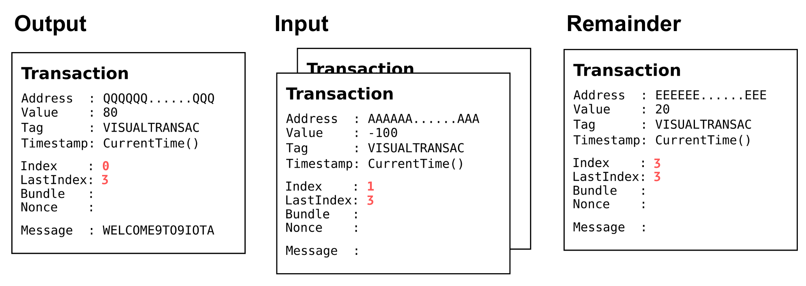

# Bundles and transactions

**A transaction is a single instruction to credit IOTA tokens (output), debit IOTA tokens (input), or send a message. To transfer IOTA tokens, you need both input and outputs transactions, which are packaged together in a bundle.**

Each transaction that's sent to an IRI node, even individual zero-value ones, must be packaged in a bundle.

You may need more than one transaction for the following reasons:

* To transfer IOTA tokens from one address to another, you need both an input transaction to debit IOTA tokens from the sender, and an output transaction to credit IOTA tokens to the recipient. These transactions must be indexed (starting from 0) and packaged together in a bundle.
* An input transaction, which debits IOTA tokens, must contain a signature in the `signatureMessageFragment` field. If the security level of the address is greater than 1, the signature is too large to fit in one transaction and must be _fragmented_ across zero-value output transactions.
* The `signatureMessageFragment` field of a transaction can contain a limited number of trytes. Therefore, to send a message that exceeds the limit, you must put the rest of the message in another transaction (transaction index 1).

## Input and output transactions

A bundle can consist of any number of input and output transactions. We recommend a maximum of 30 transactions in a bundle.

### Input transaction

Input transactions debit IOTA tokens from addresses. Bundles can contain multiple input transactions, and each one must be signed. The length of the signature depends on the [security level](../concepts/addresses-and-signatures.md#how-addresses-are-generated) of the address.

**Important:** [Addresses must not be spent from more than once](../concepts/addresses-and-signatures.md#address-reuse). Therefore, input transactions must debit all IOTA tokens from an address even if the sender does not want to transfer all of them to the recipient. The remaining IOTA tokens can be transferred to another address (usually the sender's address) in an output transaction.

### Output transaction

Output transactions can be one of the following:

* A zero-value transactions that contains only a message in the `signatureMessageFragment` field
* A transaction with a positive value that credits IOTA tokens to an address

Transactions that credit IOTA tokens can also contain a message because they don't debit IOTA tokens, and therefore don't contain a signature.

## How bundles are validated

After you send a bundle to an [IRI node](root://iri/0.1/introduction/overview.md), it validates each transaction and appends each one to the ledger.

During [tip selection](root://the-tangle/0.1/introduction/overview.md), an IRI node finds and [validates each transaction in your bundle](root://iri/0.1/concepts/transaction-validation.md#bundle-validator) by traversing its `trunkTransaction` field. When the IRI node has validated all transactions up to the [`lastIndex` field](../references/structure-of-a-transaction.md), your bundle is considered valid. When a bundle is validated, one of the transactions in it is selected as a tip transaction to be referenced and approved by another transaction.

Bundles are atomic, meaning that the fate of each transaction in a bundle depends on the rest. Either all transactions are valid or none of them are.

## Example of a bundle that transfers IOTA tokens

This bundle transfers 80 IOTA tokens to a recipient from an address with a security level of 2.

| Transaction index | Transaction contents                                                     | Transaction value                                          |
| ----- | ------------------------------------------------------------------------- | --------------------------------------------------------------- |
| 0     | Recipient's address                       | 80 (sent to the recipient's address)                    |
| 1     | Sender's address, and the first part of the signature | -100 (the total balance of the sender's address as a negative value) |
| 2     | Sender's address, and the second half of the signature.                                         | 0                                                               |
| 3     | An address for the transfer of the remaining IOTA tokens (usually one of the sender's addresses).                              | 20 (Remainder of the sender's address in transaction 1)                          |

