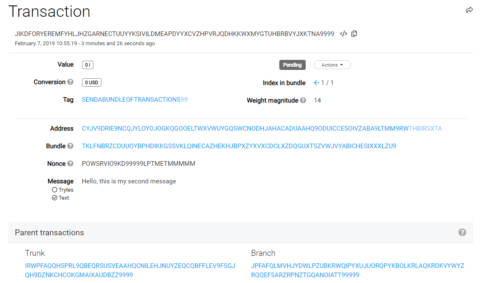

# Send a bundle of zero-value transactions

**Transactions must be grouped in a bundle before being sent to an IRI node. The IOTA client libraries have built-in functions that create bundles from transfer objects.**

If you're unfamiliar with the terms bundle or transaction, we recommend that you [read about bundles and transactions](../concepts/bundles-and-transactions.md).

Any code that uses a seed is executed on the client side. Your seed is never sent anywhere.

## Prerequisites

To complete this guide, you need the following:

* [Node JS (8+)](https://nodejs.org/en/)
* A code editor such as [Visual Studio Code](https://code.visualstudio.com/Download)
* Access to a command prompt
* An Internet connection

---

1. Create a new directory called `iota-basics`

2. In the command prompt, change into the `iota-basics` directory, and install the [IOTA Core library](https://github.com/iotaledger/iota.js/tree/next/packages/core) and the [IOTA converter library](https://github.com/iotaledger/iota.js/tree/next/packages/converter)

    ```bash
    cd iota-basics
    npm install --save @iota/core
    ```

3. In the `iota-basics` directory, create a new file called send-bundle.js

4. In the send-bundle.js file, require the IOTA libraries

    ```js
    const Iota = require('@iota/core');
    const Converter = require('@iota/converter');
    ```

5. Create an instance of the IOTA object and use the `provider` field to connect to an IRI node

    ```js
    const iota = Iota.composeAPI({
    provider: 'https://nodes.thetangle.org:443'
    });
    ```

6. Create the variables to store a seed and two addresses to which you want to send transactions

    ```js
    const seed =
    'PUETTSEITFEVEWCWBTSIZM9NKRGJEIMXTULBACGFRQK9IMGICLBKW9TTEVSDQMGWKBXPVCBMMCXWMNPDX';

    var recipientAddress1 = "CXDUYK9XGHC9DTSPDMKGGGXAIARSRVAFGHJOCDDHWADLVBBOEHLICHTMGKVDOGRU9TBESJNHAXYPVJ9R9";

    var recipientAddress2 = "CYJV9DRIE9NCQJYLOYOJOGKQGOOELTWXVWUYGQSWCNODHJAHACADUAAHQ9ODUICCESOIVZABA9LTMM9RW";
    ```

7. Create one `transfer` object for each transaction that you want to send. The `address` field contains the address to which the transaction will be sent.

    ```js
    var transfer1 = {
    'address': recipientAddress1,
    'value': 0,
    'message': Converter.asciiToTrytes('Hello, this is my first message'),
    'tag': 'SENDABUNDLEOFTRANSACTIONS'
    };

    var transfer2 = {
    'address': recipientAddress2, 
    'value': 0,
    'message': Converter.asciiToTrytes('Hello, this is my second message'),
    'tag': 'SENDABUNDLEOFTRANSACTIONS'
    };
    ```

    **Note:** The `asciiToTrytes()` method supports only [basic ASCII characters](https://en.wikipedia.org/wiki/ASCII#Printable_characters). As a result, diacritical marks such as accents and umlauts aren't supported and result in an `INVALID_ASCII_CHARS` error.

8. Use the `prepareTransfers()` method to create a bundle, then pass the returned trytes to the `sendTrytes()` method. This method asks the connected IRI node to do [tip selection](root://the-tangle/0.1/concepts/tip-selection.md), does [proof of work](root://the-tangle/0.1/concepts/proof-of-work.md), then broadcasts the bundle to the IRI node.

    ```js
    iota.prepareTransfers(seed, [transfer1, transfer2])
    .then(function(trytes){
        return iota.sendTrytes(trytes, 3, 14 );
    })

    .then(results => console.log(JSON.stringify(results, ['hash', 'currentIndex', 'lastIndex', 'bundle', 'trunkTransaction', 'branchTransaction'], 1)));
    ```

    **Note:** To be able to reattach a transaction, you should save the trytes that are returned from the `prepareTransfers()` method.

    In this example, the resulting array is converted to JSON and filtered so that only the transaction hash, bundle information, and parent transactions are displayed in the output.

    **Note:** Trunk and branch transactions are called parent transactions.
[All transactions in a bundle are connected through the value of their `trunkTransaction` fields](../references/structure-of-a-bundle.md). You should see that the `trunkTransaction` hash of transaction 0 is the same as the transaction hash (`hash`) of transaction 1.

    ```json
    [
    {
    "hash": "9FVWBYVGTMDYPIYGMEHWQSZF9CDWHRADQNYIEJARTMXFSBTSAIFJPM9PNILLLBYIKSMIIDUOVSBWZ9999",
    "currentIndex": 0,
    "lastIndex": 1,
    "bundle": "TKLFNBRZCDUUOYBPHDIKKGSSVKLQINECAZHEKHJBPXZYXVXCDCLXZDQGUXTSZVWJVYABICHESIXXXLZU9",
    "trunkTransaction": "JIKDFORYEREMFYHLJHZGARNECTUUYYKSIVILDMEAPDYYXCVZHPVRJQDHKKWXMYGTUHBRBVYJXKTNA9999",
    "branchTransaction": "IRWPFAQQHSPRL9QBEQRSUSVEAAHQCNILEHJNUYZEQCQBFFLEV9FSGJQH9DZNKCHCOKGMAIXAUDBZZ9999"
    },
    {
    "hash": "JIKDFORYEREMFYHLJHZGARNECTUUYYKSIVILDMEAPDYYXCVZHPVRJQDHKKWXMYGTUHBRBVYJXKTNA9999",
    "currentIndex": 1,
    "lastIndex": 1,
    "bundle": "TKLFNBRZCDUUOYBPHDIKKGSSVKLQINECAZHEKHJBPXZYXVXCDCLXZDQGUXTSZVWJVYABICHESIXXXLZU9",
    "trunkTransaction": "IRWPFAQQHSPRL9QBEQRSUSVEAAHQCNILEHJNUYZEQCQBFFLEV9FSGJQH9DZNKCHCOKGMAIXAUDBZZ9999",
    "branchTransaction": "JPFAFQLMVHJYDWLPZUBKRWQIPYXUJUORQPYKBOLKRLAQKRDKVYWYZRQQEFSARZRPNZTGQANOIATT99999"
    }
    ]
    ```

9. To see details about your first transaction, copy the hash of the first transaction and paste it into [thetangle.org](https://thetangle.org/). These details have been sourced from IRI nodes that the website is connected to.

    

10. To see details about your second transaction, scroll down to 'Parent transactions' and click the Trunk hash

    

## Final code

```js
// Require the IOTA libraries
const Iota = require('@iota/core');
const Converter = require('@iota/converter');

// Create a new instance of the IOTA object
// Use the `provider` field to specify which IRI node to connect to
const iota = Iota.composeAPI({
provider: 'https://nodes.thetangle.org:443'
});

const seed =
'PUETTSEITFEVEWCWBTSIZM9NKRGJEIMXTULBACGFRQK9IMGICLBKW9TTEVSDQMGWKBXPVCBMMCXWMNPDX';

var recipientAddress1 = "CXDUYK9XGHC9DTSPDMKGGGXAIARSRVAFGHJOCDDHWADLVBBOEHLICHTMGKVDOGRU9TBESJNHAXYPVJ9R9";

var recipientAddress2 = "CYJV9DRIE9NCQJYLOYOJOGKQGOOELTWXVWUYGQSWCNODHJAHACADUAAHQ9ODUICCESOIVZABA9LTMM9RW";

// Prepare transactions
var transfer1 = {
'address': recipientAddress1,
'value': 0,
'message': Converter.asciiToTrytes('Hello, this is my first message'),
'tag': 'SENDABUNDLEOFTRANSACTIONS'
};

var transfer2 = {
'address': recipientAddress2,
'value': 0,
'message': Converter.asciiToTrytes('Hello, this is my second message'),
'tag': 'SENDABUNDLEOFTRANSACTIONS'
};

// Create bundle and return the trytes of the prepared transactions
iota.prepareTransfers(seed, [transfer1, transfer2])
.then(function(trytes){
    // Finalize and broadcast the bundle to the IRI node
    return iota.sendTrytes(trytes, 3 /*depth*/, 14 /*minimum weight magnitude*/);
})

.then(results => console.log(JSON.stringify(results, ['hash', 'currentIndex', 'lastIndex', 'bundle', 'trunkTransaction', 'branchTransaction'], 1)));
```


