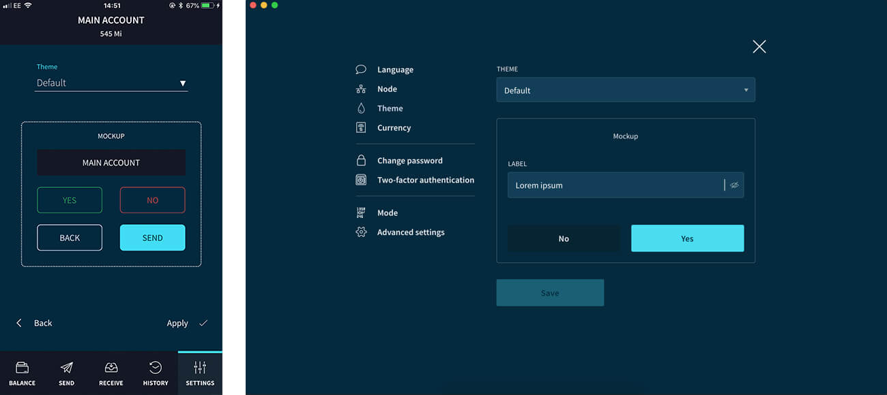
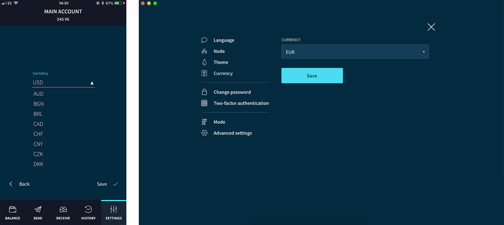
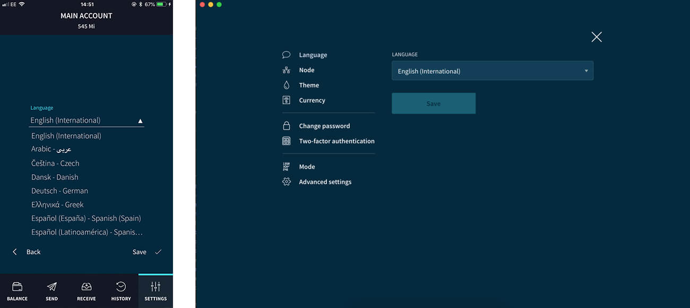
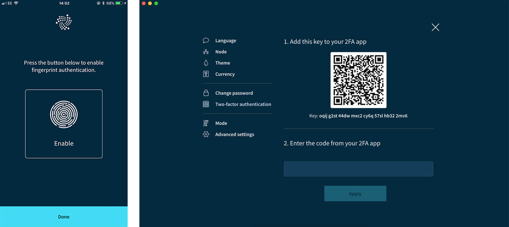

## Settings

### Mode

Change between Standard and Expert modes

### Theme

Change the default theme

### Currency

Change the default currency

### Language

Change the default language

### Account management

Here you can view your seed, view your addresses (advanced users only), edit your account name, delete your account, or add additional accounts.

#### Adding additional accounts

Trinity provides multi-account support. You can store more than one seed in your wallet. This enables you to split your funds between multiple seeds and manage them from within the same application.

Do you have more than one seed in your Trinity wallet? You can swap between accounts by pressing the dropdown at the top of the screen on mobile or in the sidebar on desktop.

>Please ensure you have at least one proper seed backup for each new seed you create.

#### Change password

Change your account password.

#### Security Settings

Setup two-factor authentication or biometric authentication.

### Advanced Settings

Changing any of the advanced user settings is discouraged. Most users only perform snapshot transitions or a manual sync.

#### Nodes

Trinity provides a built-in node-balancing service for optimal performance. Every time you open your wallet, it selects a healthy node with a low current load.

<i>Advanced users </i> may turn off node-balancing by going to the Select node page in Advanced settings. There you may also add your own custom node.

#### Automatic Promotion/Reattachment

To ensure transactions are confirmed on the Tangle, it may be necessary to promote or to reattach. When possible, Trinity will do this automatically.

<i>Advanced users </i> may enable manual promotion/reattachment by turning on Expert mode in Advanced settings. Enabling manual promotion/reattachment will not disable the automatic promotion/reattachment feature.

>Trinity does not promote/reattach transfers if the application is minimized. Currently automatic promotion/reattachment only takes place when the app is open.

#### Snapshot Transition

Following a snapshot, users must perform a snapshot transition.

Snapshot transition is located in Advanced settings. Every so often, a snapshot is performed on the Tangle. Snapshots reduce the size of the Tangle database. All transaction data is deleted and only non-zero address balances are retained. Because Trinity is stateful, it will store a copy of your transactional history after a snapshot. This means that after the snapshot erases transaction data from the Tangle, you still see them in your wallet.

#### Manual Sync

If your balance or history appears incorrect, a manual sync can fix it.

With Manual Sync Trinity double-checks your history and balances with the IOTA network. The action may take a while, so please be patient and keep Trinity in the foreground!
